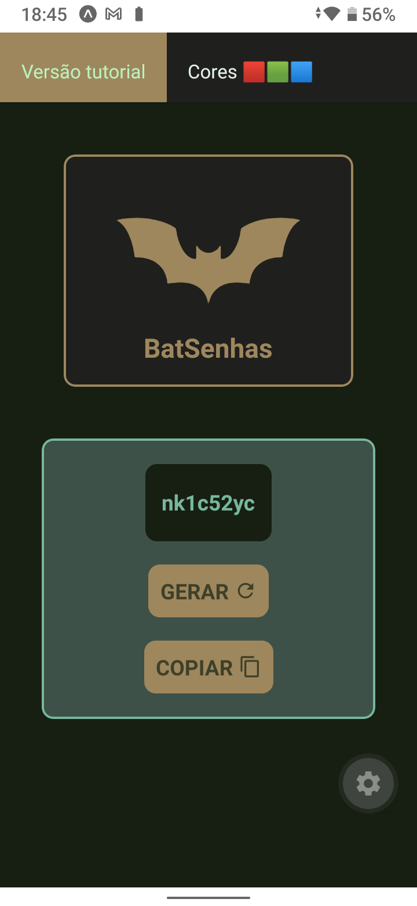
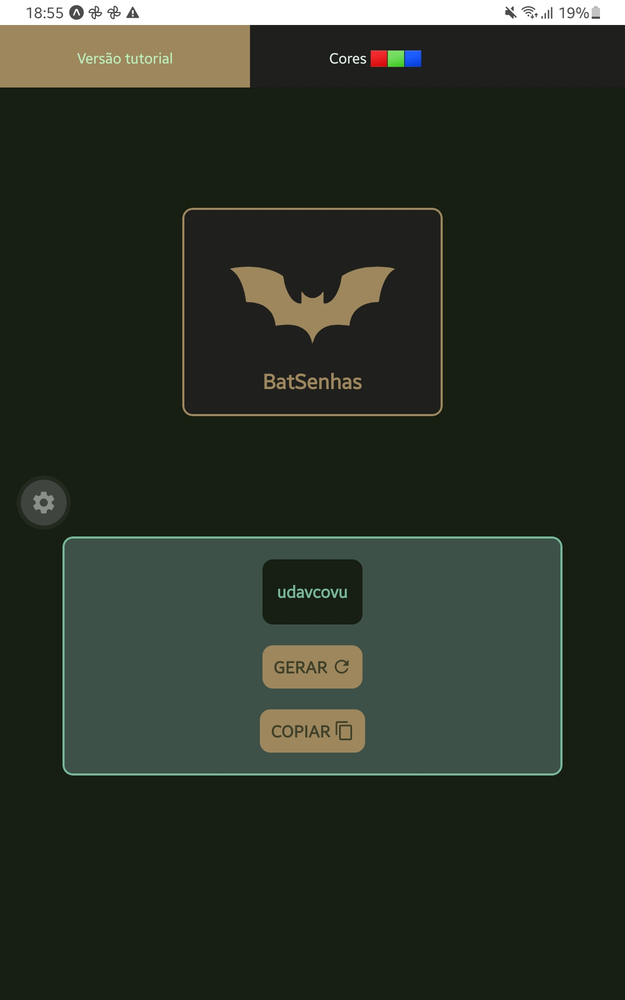

<h1> BatSenhas</h1>

    
    
    
    

## Preview

  <table>
    <tr>
      <td align="center"><b>Versão celular</b></td>
      <td align="center"><b>Versão tablet</b></td>
    </tr>
    <tr>
      <td align="center">
        
      </td>
      <td align="center">
        
      </td>
    </tr>
  </table>

## 📱 Features
✅ Gera senhas aleatórias; 
✅ Permite copiar para área de transferência;

## Tecnologias

-   [React Native](https://reactnative.dev/)
-   [Expo](https://docs.expo.dev/)

## Autor

| [ Biel Souza](https://github.com/felipeAguiarCode) |
| :---------------------------------------------------------------------------------------------------------------------------------------: |
|                                             [Linkedin](www.linkedin.com/in/gabriel-souza-mobiledev)                                             |